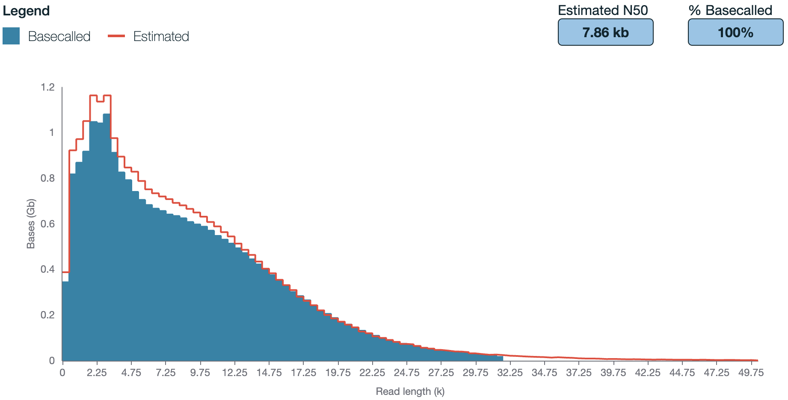

# Prerequisites, equipment and consumables {#prerequisites}

## Prerequisites

-   Experience with basic molecular laboratory techniques and DNA quality control (use of laminar flow hood, pipetting micro volumes, handling and preserving small volume reagents, sterilisation of consumables, doing gel electrophoresis)
-   Experience with loading Nanopore flowcells
    -   It is vital that loading of the flowcell is practiced.The key is to avoid any air entering the flow cell as that will completely destroy the pores. Use an old flowcell if available and run through the process with water to see where the buffers flow. Afterwards we recommend doing a Control run with Lambda DNA using the [Control Expansion Kit](https://store.nanoporetech.com/control-expansion.html)).
-   Confident with R, R Studio and package environment managers such as Conda and Docker. Knowledge in shell scripting and Linux syntax.

## DNA extraction kit

We commonly extract DNA from soils or from wastewater sludges using the DNeasy Powersoil Pro Kit (Qiagen) for both, soil and sludge. It resulted in high quality DNA, suitable for library preparation and sequencing. Extraction with this kit includes a bead beating step to release DNA from cells out of difficult matrices such as soils and sludge (biofilms) or similar. The sheared DNA will be fragmented with a N50 of \~7 kb in some cases [@Jensen2024]. Shearing of DNA may be minimised by reducing/optimising bead-beating duration and speed. Other commonly used and commercially available kits for DNA extraction are available [@Jensen2024; @Gand2023].

{width="600"}

## Other consumables

-   Native Barcoding Kit (Oxford Nanopore, SQK-NBD114.96)\
-   R10.4.1 flowcell (Oxford Nanopore, FLO-MIN114)
-   NEBNext Quick Ligation Module (E6056, New England Biolab)
-   NEBNext Ultra II End repair/dA-tailing Module (E7546S, New England Biolab)
-   Blunt/TA Ligase Master Mix (M0367, New England Biolab)
-   10 mM dNTPs (N0447S, New England Biolab)
-   Q5 Hot Start High-Fidelity DNA Polymerase (M0493, New England Biolab)
-   DNeasy Powersoil Pro Kit (#47016, Qiagen)
-   Qubit 1X dsDNA BR or HR Assay Kit (Q33266 or Q33231, Thermo Fisher)
-   Eppendorf LoBind tubes (Eppendorf)
-   twin.tec® PCR plate 96 LoBind, semi skirted (0030129504, Eppendorf)
-   JetSeq Clean Magnetic beads (MER-BIO-68031, Millenium Science) - to clean up PCR products
-   10 µM Forward Primer A519F (CAGCMGCCGCGGTAA) [@Martijn2019]
-   10 µM Reverse Primer U2428R (CCRAMCTGTCTCACGACG) [@Martijn2019]
-   Nuclease-free water
-   10 mM Tris-HCl pH 8.0 with 50 mM NaCl (UltraPure™ 1M Tris-HCI, pH 8.0 #15568025 & NaCl (5 M), RNase-free #AM9760G, Thermo Fisher)
-   Bovine Serum Albumin (BSA) (50 mg/ml) (AM2616, InvitrogenTM UltraPure)
-   HyperLadder 1kb (BIO-33025, Bioline, Millenium Science)
-   80% ethanol, freshly prepared in nuclease-free water
-   Flow Cell Wash Kit (e.g. EXP-WSH004, Oxford Nanopore)

## Protocols

-   A protocol for PCR amplification and clean-up (included in this Gitbook).
-   `Ligation sequencing amplicons - Native Barcoding Kit 96 V14` available on nanoporetech.com.
-   Prepare spreadsheets to normalise DNA into 96-well plates to avoid pipetting errors.
-   `Flow Cell Wash Kit (EXP-WSH004 or EXP-WSH004-XL)-minion.pdf` available on nanopore.com.

## Equipment

-   Nanopore sequencer. This protocol is based on the MinION Mk1C but is not limited to this model.
-   Nanodrop spectrophotometer to check DNA quality.
-   Qubit fluorometer (Thermo Fisher).
-   PCR thermal cycler.
-   Magnets for 96-well plates and 1.5 ml tubes.
-   Gel electrophoresis equipment.
-   Vortex. We use the Vortex-Genie 2, including the 24 x 2 ml tube adapter for bead beating.
-   Hula mixer (#15920D, Thermo Fisher) or similar overhead mixers.
-   Eppendorf LoBind tubes (Eppendorf)

## Computational resources and database

-   For basecalling the raw nanopore data (pod5 files) with dorado - an instance or computer is required with ≥ 2 TB storage, ≥ 16 GB RAM and either Nvidia A100 GPUs (Linux/Windows) or M1/M2 GPUs/CPUs (Mac). 64 GB RAM is recommended. Note that the MinION Mk1C can also basecall the data (much easier) but only at High Accuracy (HAC) and not at Super High Accuracy (SUP). SUP achieves \~Q20 while HAC only \~Q18. Note that basecalling can take days depending on the computational resources.
-   16S-ITS-23S Database. To be confirmed.
