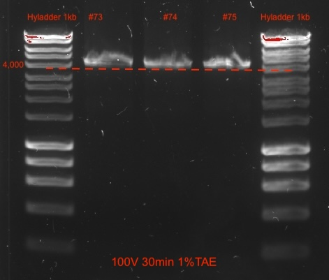
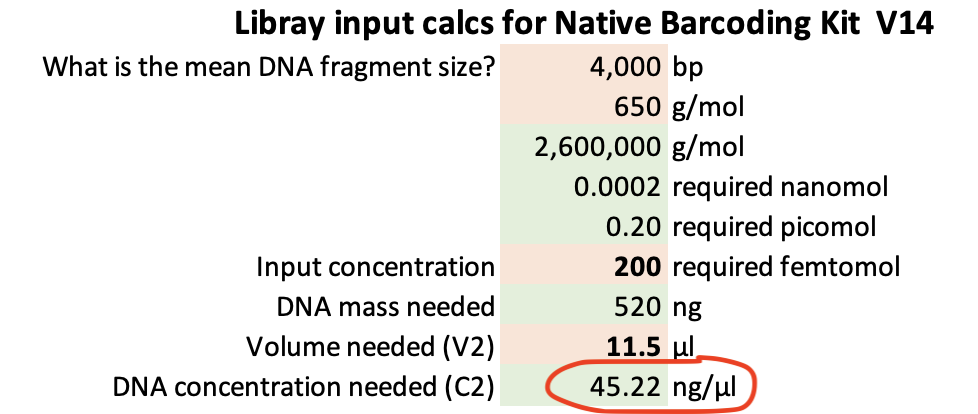
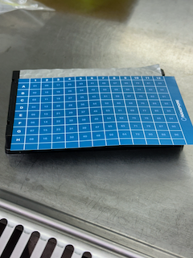
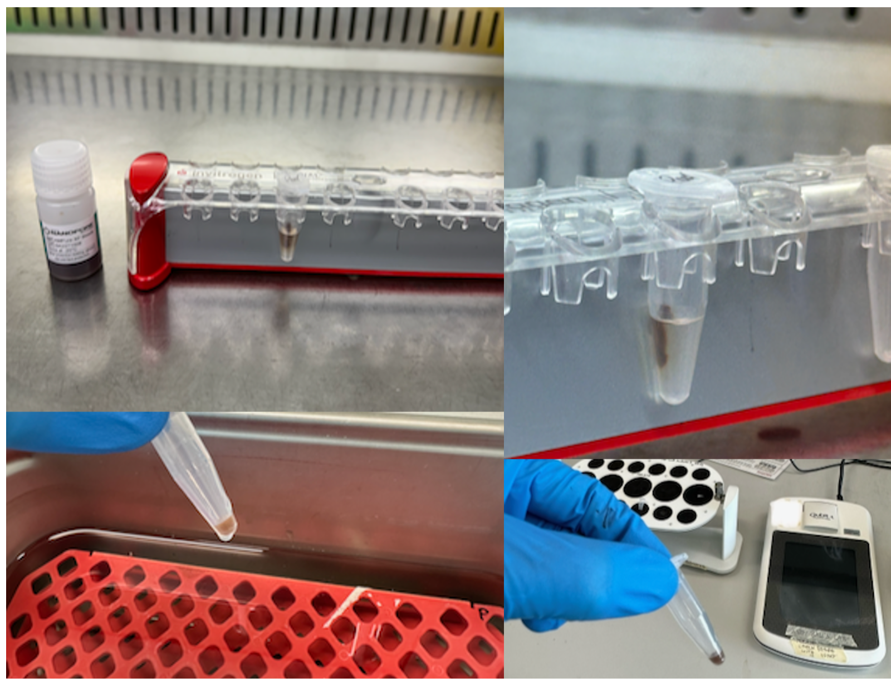
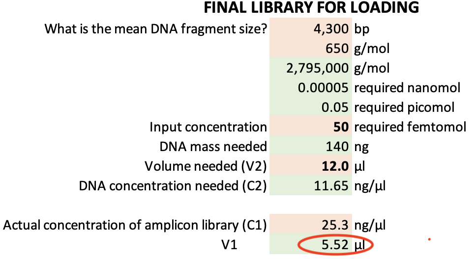

# Protocol

## DNA extraction

### Checklist

-   Extraction kit - [DNeasy Powersoil Pro, Qiagen, Hilden, Germany](https://www.qiagen.com/au/resources/resourcedetail?id=9bb59b74-e493-4aeb-b6c1-f660852e8d97&lang=en). See Section \@ref(prerequisites) for more details.
-   Alternatively the high throughput version of the kit used with the QIAcube [DNeasy 96 PowerSoil Pro QIAcube HT Kit](https://rmiteduau-my.sharepoint.com/personal/christian_krohn_rmit_edu_au/Documents/Experiments/2025_ETPSequencingProject/_%09https:/www.qiagen.com/au/products/discovery-and-translational-research/dna-rna-purification/dna-purification/microbial-dna/dneasy-96-powersoil-pro-qiacube-ht-kit).
-   Vortex with 24 x 1.5 mL tube adapter (e.g. Vortex Genie 2 + adapter). Alternatively, a PowerLyzer Homogenizer.
-   NanoDrop spectrophotometer to assess DNA quality.
-   Qubit fluorometer to accurately measure DNA concentrations.

### Steps

-   Follow the extraction kit's protocol with 15 mins bead beating using a Vortex-Genie and 24-tube adapter. Reduce this to 10 mins if less than 24 samples are extracted or if shearing of DNA should be minimised.
-   Measure DNA quality using DNA extract (1 µL) using a Nanodrop spectrophotometer
-   Measure DNA concentration using a Qubit fluorometer.
-   Into a 96-well plate, normalise extracted DNA to required PCR concentrations. For example, if 10 ng template is required for PCR, normalise DNA to 5 ng/µL.
-   Store DNA at 4˚C until library preparation - no more than 1 week.
-   Store DNA at -20˚C if sequencing is more than 1 week away.

## Amplification of 16S-ITS-23 operon

### Checklist

-   10 mM dNTPs (N0447S, New England Biolab)
-   Q5 Hot Start High-Fidelity DNA Polymerase (M0493, New England Biolab)
-   10 µM Forward Primer A519F (CAGCMGCCGCGGTAA) [@Martijn2019]
-   10 µM Reverse Primer U2428R (CCRAMCTGTCTCACGACG) [@Martijn2019]
-   JetSeq Clean Magnetic beads - or equivalent (MER-BIO-68031, Millenium Science) - to clean up PCR products
-   twin.tec® PCR plate 96 LoBind, semi skirted (0030129504, Eppendorf)
-   Nuclease-free water
-   10 mM Tris-HCl pH 8.0 with 50 mM NaCl (UltraPure™ 1M Tris-HCI, pH 8.0 #15568025 & NaCl (5 M), RNase-free #AM9760G, Thermo Fisher)
-   HyperLadder 1kb (BIO-33025, Bioline, Millenium Science)
-   80% ethanol, freshly prepared in nuclease-free water
-   Qubit 1X dsDNA BR Assay Kit (Q33266, Thermo Fisher)

**Notes**

-   Do not vortex tubes during library preparation to prevent DNA fragmentation. Fragmentation of amplicons may lead to incomplete reads.
-   The primer amplifies the whole rrn operon.

Benefits of targeting the whole rrn operon:

-   Superior species-level resolution and accuracy [@Cusco2018; @Srinivas2024].
-   Covers Bacteria and Archaea.

Risks of targeting the whole rrn operon:

-   Not as representative of true abundances as full-length 16S amplicons.
-   Species with unlinked 16S and 23S rrn DNA will be missed with this approach (for example \< 9% of rRNA genes in wastewater sludge [@Brewer2020]).

### PCR

Time required: \~4 hrs incl. 2hrs, 40mins PCR.

-   Prepare a PCR mastermix for the required number of 50-µl reactions (Table 3.1). It may be necessary to combine two 50 µl reactions for each sample to produce sufficient amplicon mass for a final concentration of 200 fmol as input for the Native Barcoding Kit from Oxford Nanopore.
-   Add 3 µl of eDNA (5ng /µl) into a 96-well plate (e.g. Eppendorf twin.tec® PCR plate 96 LoBind, semi-skirted) using a multichannel pipette.
-   Add 47 µl of mastermix using a multichannel pipette and carefully pipette up and down 10 x
-   Run thermocycler (Table 3.2).
-   Verify amplification length via 1% agarose gel electrophoresis \@ 100V for 30 min including a 1 kb ladder.
-   Store at 4˚C overnight if needed.

**Important**:

-   Use hot start polymerase for ease of use, with high fidelity/accuracy and one that is suitable for long amplicons. For example, Q5 High- Fidelity DNA Polymerase kit (New England Biolabs) with GC enhancer [@Martijn2019].

-   ≤ 200 fmol is required per sample for the Native Barcoding Kit from ONP. Based on 4.25 kb (4-4.5kb), the final DNA concentration after cleaning up PCR products should be no less than 48 ng/µL (at 11.5 µl input volume) - giving 552 ng of 4.25kb amplicons.

-   It may require two PCR reactions to achieve the required DNA amount (200 fmol); e.g. pool 2 x 50µl PCR products, clean combined and elude in 32.5 µl Tris.

       

```{r table, tidy=FALSE, echo=FALSE, message=FALSE, tidy=FALSE}
library(tidyverse)
pcr <- read.csv("PCR.csv",header=TRUE, stringsAsFactors=FALSE, fileEncoding="latin1")
pcr <- pcr %>% dplyr::rename(`50 µl reaction` = "Fifty.microL.Reaction" )
pcr <- pcr %>% dplyr::rename(`Final concentration` = "Final.Concentration" )
knitr::kable(
 pcr, caption = 'List of components for each reaction (each tube) for PCR. See https://www.neb.com/en-au/protocols/2012/08/30/pcr-using-q5-hot-start-high-fidelity-dna-polymerase-m0493 for details.  ',
 booktabs = TRUE
)
```

 

```{r table2, tidy=FALSE, echo=FALSE, message=FALSE, tidy=FALSE}
library(tidyverse)
pcrcond <- read.csv("PCRcond.csv",header=TRUE, stringsAsFactors=FALSE, fileEncoding="latin1")
pcrcond <- pcrcond %>% dplyr::rename(`Cycle conditions` = "Cycle.conditions" )
knitr::kable(
 pcrcond, caption = 'Thermocycler conditions (Martijn et al 2019).',
 booktabs = TRUE
)
```

\

## PCR product clean-up

Clean with 0.6X JetSeq Clean Magnetic beads (or equivalent) and wash twice with 80% ethanol. This follows a similar protocol to the Illumina 16S-metagenomics library prep guide in case you are familiar with that.

Time required: \~ 1 hr per 24 samples.

### Checklist

-   Magnetic rack for 96-well plate (e.g. #AM10027 Thermo Fisher)
-   80% ethanol, freshly prepared in nuclease-free water
-   Nuclease-free water
-   10 mM Tris-HCl pH 8.0 with 50 mM NaCl (UltraPure™ 1M Tris-HCI, pH 8.0 #15568025 & NaCl (5 M), RNase-free #AM9760G, Thermo Fisher)
-   JetSeq Clean Magnetic beads (MER-BIO-68031, Millenium Science) or equivalent - to clean up PCR products
-   Qubit 1X dsDNA BR or HR Assay Kit (Q33266 or Q33231, Thermo Fisher)
-   HyperLadder 1kb (BIO-33025, Bioline, Millenium Science)
-   A worksheet to enter concentrations to calculate volumes to normalise DNA to 200 fmol

**Note**

Use wide bore tips for adding mag beads and subsequent (careful) mixing by pipetting to minimise DNA fragmentation.

### Steps

-   Pool replicate reactions into one well - e.g. 2 x 50 µl = 100 µl in one well.
-   Using a multi-channel pipette, add 0.6X beads to PCR products in the same wells (e.g. 60 µl to 100 µl pooled reactions), pipette 10 x up and down and/or a gentle vortex after sealing the plate, careful not to spill (Vortex Genie speed 2).
-   10 min incubation at RT
-   Place plate on a magnetic rack for 5 mins and remove supernatant.
-   Wash twice with 200 µl 80% ethanol in same 96-well plate, discard ethanol and let evaporate for \~ 5 mins or until completely removed.
-   Take plate off magnet and elude pellet to a volume that provides appropriate DNA concentrations
    -   e.g. add 32.5 µl of elution buffer (10 mM Tris 50mM NaCl). The pellet will be stuck higher than the buffer surface in the well.
    -   Hence, pipetting up and down 20–30 x may be necessary to carefully wash the pellet of the tube wall, using a wide bore tip.
    -   And/or centrifuge plate at 200 rcf for 1 min.
-   Off-magnet, incubate plate for 15 minutes at 37°C (e.g. in a water bath with only the wells submerged in water). Every 2 minutes, agitate the sample by gently vortexing the plate for 10 seconds (after sealing plate) to encourage DNA elution - and spin plate down.
-   Collect 32 µl of cleaned DNA after \~ 5 mins on magnet using wide bore tips.
-   Quantify and record amplicon concentrations using Qubit HS or BS chemistry and record values. Based on 4 kb amplicons, the final DNA concentration after cleaning up PCR products should be no less than 45 ng/µL to have sufficient material for downstream library preparation (200 fmol, \> 520 ng of 4 kb amplicons).
-   Verify amplification length via 0.5-1% agarose gel electrophoresis \@ 100V for 30 min including a 1 kb ladder.
-   For each sample calculate volumes required of cleaned DNA and H~2~0 to get 200 fmol in 11.5 µl - for library preparation with the Native Barcoding Kit from Oxford Nanopore. Use V1 = C2\*V2 / C1, where V1 = x, C1 = DNA concentrations (ng/µl), C2 = 45.22 ng/µl, V2 = 11.5 µl). H~2~0 volume = 11.5 µl - V1. These volumes will be used in the next step.

\

{width="300"}

\

{width="400"}

\

{width="300"}

 

## Library preparation

DNA Library preparation, including barcoding and pooling of samples (multiplexing). Here the DNA input are \>4 kb amplicons of the 16S-ITS-23S rRNA operon from environmental DNA. The Long Fragment Buffer (LFB) is used (not the Short Fragment Buffer)

Time required: \~ 6 hours from start to finished library ready for loading.

**Notes**

-   Follow the protocol `Ligation sequencing amplicons - Native Barcoding Kit 96 V14 (SQK-NBD114.96)-minion.pdf` available on nanoporetech.com. For details about the barcodes check here: <https://community.nanoporetech.com/technical_documents/chemistry-technical-document/v/chtd_500_v1_revaq_07jul2016/barcode-sequences>. For final library calculations we assume that around 300 bps are added to the amplicons through barcodes, flanking sequences and adapters. If you know more - let us know on the Github discussion section.
-   Update the MinION packages and MinKNOW software.
-   Prepare a sample sheet for upload to instrument if desired (not essential but saves a little time when setting up the sequencing in MinKNOW). More info on how to upload sample sheets [here](https://community.nanoporetech.com/docs/prepare/library_prep_protocols/experiment-companion-minknow/v/mke_1013_v1_revdc_11apr2016/sample-sheet-upload).
-   Amplicon product yields from PCR can vary widely depending on environmental source.
-   To achieve consistent, normalised concentrations (200 fmol) across all samples, add appropriate input volume (calculated with C1\*V1 = C2\*V2) and fill to 11.5 µl with H~2~0 to the first step of the Native Barcoding kit protocol.
-   If you plan to sequence after library preparations, insert a flow cell now and do a **flow cell check** and record the number of pores. This will take around 10 minutes. Afterwards store it at 4˚C until ready to load. We got 1,500-1,750 pores with new flowcells (R10.4.1) that were stored for two weeks at 4 degrees.

### Checklist

-   Native Barcoding Kit (Oxford Nanopore, SQK-NBD114.96)
    -   End-prep
        -   DNA Control Sample (DCS)
        -   Elution Buffer (EB)
    -   Native barcode ligation
        -   AMPure XP Beads (AXP)
        -   EDTA
        -   Native Barcodes (NB01-96)
    -   Sequencing adapter ligation
        -   Native Adapter (NA)
        -   Elution Buffer (EB)
        -   AMPure XP Beads (AXP)
        -   Long Fragment Buffer (LFB)
-   NEBNext Quick Ligation Module (E6056, New England Biolab)
-   NEBNext Ultra II End repair/dA-tailing Module (E7546S, New England Biolab)
-   Blunt/TA Ligase Master Mix (M0367, New England Biolab)
-   80% ethanol, freshly prepared in nuclease-free water
-   Nuclease-free water
-   Qubit 1X dsDNA BR or HR Assay Kit (Q33266 or Q33231, Thermo Fisher)
-   Eppendorf LoBind tubes (Eppendorf)
-   Magnet for 1.5 ml tubes
-   Hula mixer (#15920D, Thermo Fisher) or similar overhead mixers

### Steps

**Follow the Nanopore protocol. There are four parts:**

1.  End-prepping of 11.5 µL DNA (200 fmol).\
    Pipetting into the 96-well plate may take time as there are two rounds of pipetting, one for the DNA amplicon volumes and one for H~2~0 volumes to get 200 fmol amplicon DNA in 11.5 µl, as well as the remaining reagents for end-prepping the DNA. It is not possible to use multichannel pipettes for this step.

2.  Native barcode ligation using 0.75 µL of end-prepped DNA using one of 96 barcodes from the kit for each sample, plus pooling of all barcoded samples into a LoBind tube (1.5 mL).

3.  Bead clean-up of pooled end-prepped DNA library and elution of 35 µL volume; quantification with Qubit 1X dsDNA HS Assay Kit. We used the all of the available end-prepped volume (e.g. 33 µl after Qubit quantification) for the next step, i.o. only 30 µl as per protocol.

    SAFE STOP: Store at 4 ˚C overnight if needed.

4.  Adapter ligation. Once this step is completed, you get a final volume of 15 µl of clean end-prepped/barcoded/adapter ligated DNA.

    -   We have stored the library at 4˚C overnight and sucessfully sequenced it the next day (although it is preferred to sequence right after adapter ligation).

    -   The concentration we achieved was \~20-25 ng/µl, which means there was sufficient DNA for two runs. After quantify DNA concentrations with 1 µl DNA there are 14 µl left.

    -   Nanopore's recommended loading concentrations are 35–50 fmol at 12 µL volume. For example, at a concentration of 25.3 ng/µl (4,300 kb amplicon) a total of 5.50 µl of DNA library (plus 6.50 µl H~2~0) are sufficient. The remaining 6.50 µl DNA library can be stored in fridge overnight if required.

{width="300"}

\

{width="500"}

{width="300"}

## Priming and loading of flow cell - run start

Time required: \~10-15 mins for priming and loading. 24 hours for sequencing.

### Checklist

-   The same protocol: `Ligation sequencing amplicons - Native Barcoding Kit 96 V14 (SQK-NBD114.96)-minion.pdf` available on nanoporetech.com
-   Bovine Serum Albumin (BSA) (50 mg/ml) (AM2616, InvitrogenTM UltraPure)
-   Native Barcoding Kit (Oxford Nanopore, SQK-NBD114.96)
    -   Flow Cell Flush (FCF)
    -   Flow Cell Tether (FCT)
    -   Sequencing Buffer (SB)
    -   Library Beads (LIB)
-   R10.4.1 flowcell (Oxford Nanopore, FLO-MIN114)

### Steps

**Follow the Nanopore protocol. There are five steps:**

1.  Preparation and loading of sequencing buffer and wait for 5 minutes.
2.  Preparation of library. Nanopore's protocol recommends loading 35–50 fmol at 12 µL volume.
3.  Loading of remaining sequencing buffer
4.  Loading of library
5.  Setting up the run for 24 hours and press start! More details will follow about recommended hours and expected yield based on 24 samples.

## Flow cell wash

Time required: \~ 1.5 hours.

Wash the flow cell once the run has finished. Note that after the wash you can either load a new library directly afterwards or add storage buffer to load a new library later (always store flow at 4 ˚C).

However, it is only possible to check the number of pores (and estimate potential yield) after adding storage buffer. The washing buffer is not suitable for a running a flow cell check. So loading a new library directly is only sensible if the user knows how many active pores to expect. Although, the instrument will do a pore scan at the start, it will be too late once you loaded the new library.

As a gauge, we ran a flowcell with 1,500 pores for 24 hours (loaded with 24 barcoded samples of 16S-ITS-23S amplicons). At the end 558 active pores remained before the wash.

Note that washing the flowcell does not interfer with any active basecalling processes on the Mk1C, which may take days to finish if High Accuracy was chosen.

### Checklist

-   Flow Cell Wash Kit (e.g. EXP-WSH004, Oxford Nanopore)
-   Protocol `Flow Cell Wash Kit (EXP-WSH004 or EXP-WSH004-XL)-minion.pdf` available on nanopore.com

### Steps

**Follow the Nanopore protocol. There are three steps:**

1.  Preparation of 400 µl washing buffer
2.  Load 200 µl of washing buffer, wait 5 minutes, then add the remaining 200 µl and wait 1 hour.
3.  If you plan to store the flowcell for later use - add storage buffer. Otherwise load new library.

## Basecalling

Time required: \~ several days depending on computational resources.

**Details to follow**
