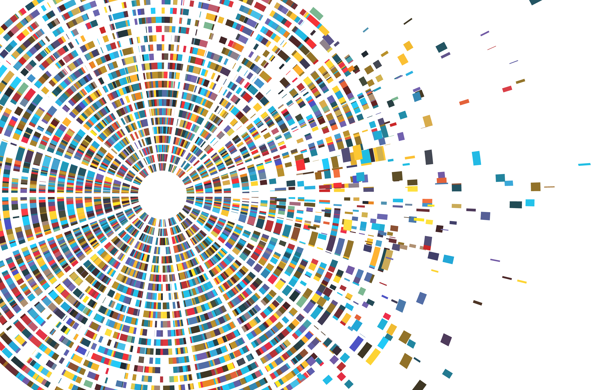
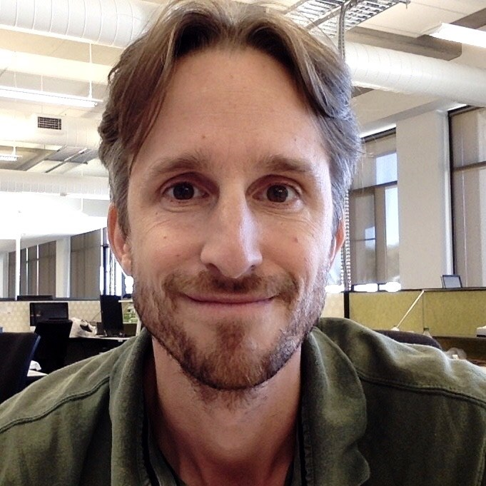

# About this GitBook {#about}

{width="500"}

This GitBook is under development (2024).

This GitBook provides a step-by-step protocol for anyone who want to get started with sequencing multiple samples of high quality, full-length microbial amplicons (16S-ITS-23S) with an Oxford Nanopore instrument, and then process and visualise the data using various packages in R. The aim is to profile a community of bacteria and archaea on **species-level**.

Read and use this protocol either directly or to develop your own. 

Note that using the 16S-ITS-23S primer pair we use in this workflow does not result in a true representation of microbial abundances. Coverage seems scattered with some key bacteria and archaea underrepresented. Also note that the read classification used (`wf-metagenome` workflow from EPI2ME, with kmer-based read predictions) will provide classified reads of Bacteria and Archaea but, depending on the read quality, will result in some false positives. And again, abundances will not be a true representation as no clustering, dereplication or ASV generation is involved. Results will not be comparable to other studies.

However, this method will provide read classification to species-level, which may be useful in cases when you are not interested in the true representation of relative abundances. For example, if you are after temporal variation, or differences between your samples in your experiment.

This protocol reflects the experiences we had in the lab and may help to get you started on your own journey of discovery. One of the biggest hurdles is the effort required to learn new technologies, hence this protocol aims at lowering your 'activation' energy by providing some guidance for each step from DNA extraction, to amplification, library preparation, sequencing, data processing and finally some basic visualisations in R.

This protocol uses the DNeasy Powersoil Pro Kit (Qiagen, Hilden, Germany) to extract DNA from wastewater sludge, as well as the Native Barcoding Kit (SQK-NBD114.96) with a R10.4.1 flowcell (FLO-MIN114) to sequence long (\~4-4.4 kb) amplicons from environmental DNA. The primer used was developed by [@Martijn2019]. Initial costs to purchase all consumables will be \~AUD\$7,700.

Check out our workflows for short-read 16S sequencing at <https://chrismitbiz.github.io/ABlab-workflows> if you want to get started with Miseq 16S sequencing instead.

If you are interested in sequencing the living biomass via PMA treatment in combination with short-read 16S sequencing, check out our recent paper [Dead in the water – Role of relic DNA and primer choice for targeted sequencing surveys of anaerobic sewage sludge intended for biological monitoring](https://doi.org/10.1016/j.watres.2024.121354) [@Krohn2024]

**Get in touch**

We work at the Andy Ball lab, RMIT University, Bundoora, Melbourne and are part of the Industry-led [Biosolids Training Centre](https://www.transformingbiosolids.org.au). Email me or comment on the discussion section of the [GitHub repository](https://github.com/chrismitbiz/ABlab-workflows/discussions/){target="_blank"} for this GitBook. You will need to get a GitHub account to join the discussion. Its free.

More about me and my PhD research can be found here: <https://clean-dirt-digests.netlify.app>.\
Follow me on [X](https://twitter.com/CleanDirtChris) (hardly use that anymore though) or [LinkedIn](https://www.linkedin.com/in/christian-krohn-54904855).

 

{width="150"}

Bio:\
Dr Chris Krohn is an early career researcher whose interests could be summed up with: “Environmental sequencing, microbial ecology, chlorinated pollutants, organic matter, wastewater, anaerobic digestion, and how everything connects".

In 2021 I joined the ARC Biosolids Training Centre at RMIT (www.transformingbiosolids.org.au), where we help water utilities to improve circular resource management by getting more renewable biogas and carbon/fertiliser values out of our municipal biosolids (essentially our poo). In project 1C of the Centre I develop metagenomic (DNA-based) methods to monitor the microbiome of anaerobic digestion, an important microbial treatment process for wastewater. I believe DNA-based diagnoses of wastewater sludges will help the water/biosolids sector improve resource recoveries and risk management.

Before that, after a career in one of the most fast-cycled and short-sighted manufacturing industries that took me from Germany to Vietnam and Hong Kong/Shenzhen, I decided to hit the switch and start thinking long-term and circular. Ten back-to-uni years later, in 2021 I finished a PhD in Soil Science at La Trobe Uni where I sequenced soil DNA and explored if and how soil biology was involved in the degradation of extremely persistent legacy pesticides that contaminate agricultural surface soils since several decades.\

 This work is licensed under a <a rel="license" href="http://creativecommons.org/licenses/by/4.0/">Creative Commons Attribution 4.0 International License</a>.
